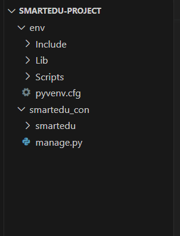

# Django Notlarım

## Django ile SmartEdu Projesi Kurulum Aşaması

### 1. Sanal ortam kuruyoruz(Programlar güncellendiğinde vs. eski sürümlerle devam edebilmek için)

```cmd
python -m venv env
```

### 2. Sanal çerçeveniyi başlatmak
```cmd
env\Scripts\activate
```
### 3. Django kuruyoruz
```cmd
pip install Django
```
_var olan paketleri görmek için pip freeze kullanabilriz_

### 4. Pip uptade uyarası gelebilir bunun için pip'i update yapcağız
```cmd
python -m pip install --upgrade pip
```

### 5. Django projesi oluşturuyoruz
```cmd
django-admin startproject smartedu
```
_bu komuttan sonra smartedu isimli django projesi oluşturulur içersinde smartedu dosyası ve manage.py dosyası mevcut olur.Dıştaki smartedu isimli dosyamızın ismnini karışıklık olmaması için değiştirebiliriz. smartedu-con ismini koyuyoruz_

### 6. Projemizin dosyasının içine giriyoruz ve Django projesini başlatıyoruz
```cmd
cd smartedu_con

python manage.py runserver
```

**Mevcut Görünüm şu şekilde olmalı;**



### 7. HTML-DESIGN sitesinde bir template almıştık bu dosyanın ismini SITE olarak değiştirip projemizin içerisine atıyoruz. Atacağımız yer SMARTEDU-PROJECT dosyası yanı en dış dosya.

**Mevcut Görünüm şu şekilde olmalı;**


**NOT:** Projeyi kapattıktan sonra devam etmek için geri geldiğimizde env aktif etmemiz gerekli. 

## Uygulama oluşturma aşaması

Projemizde uyulamalarımız olacak bu uygulamar aracılığıyla daha kullanışlı kolay bir proje oluşturabiliriz

### 1. Uygulama oluşturma;
Pages isimli bir ugulama dosyası oluşturuyoruz

```cmd
python manage.py startapp pages
```
### 2. Uygulamayı kaydetme;
Unutmamamız gereken önemli bir aşama uyuglamayı oluştururduktan sonra bunu ana uygulamamızın içindeki settings.py dosyasının içinde mevcut olan INSTALLED_APPS dizisinin içersine kaydetmek.
```python
INSTALLED_APPS = [
    'django.contrib.admin',
    'django.contrib.auth',
    'django.contrib.contenttypes',
    'django.contrib.sessions',
    'django.contrib.messages',
    'pages.apps.PagesConfig', # <-- Buraya kaydetttik
]
```
### 3. İlk Sayfayı oluşturma;
Sayfa oluşturmak için bu sayfaların isteklerini ve karşılıklarını düzenleyen fonksiyonlar belirlememiz gerekli. Bu fonksiyonları views.py dosyası içersinde yazarız.
#### Şimdi index isimli bir fonksiyon oluşturacağız
```python
from django.shortcuts import render
from django.http import HttpResponse
# Create your views here.

def index(request):
    return HttpResponse("<h1> INDEX SAYFASI</h1>")
```

Bu fonksiyonun isteği ana uygulamanını urls.py dosyası içerisinde yapılır. Fakat daha uygun bir yöntem olarak. Her uygulamaya urls.py dosyası oluşturup buranın içersine path' lar yazabiliriz.
Sonrasında ise ana uygulamanın içersindeki urls.py dosyasına bağlayabiliriz.

#### Pages içersine url.py dosyası oluşturalım

İçersinde gerekli importlerı yapalım ve url yolumuzu view.py içersinde yazdığımız index fonksiyonu ile bağlayalım.

```python
from django.contrib import admin
from django.urls import path
from . import views # buradaki fonksiyonu kullanacağımız için bunuda importluyoruz
urlpatterns = [
    path('', views.index, name='index'),
    # path('domaine yazılan isim', (fonksiyon), 'isimlendirme)
]
```
#### Ana Uygylama içindeki urls.py' a pages urls.py bağlama işlemi

Include metodu kullanacağız import ediyoruz

```python
from django.contrib import admin
from django.urls import path,include

urlpatterns = [
    path('admin/', admin.site.urls),
    path('pages/', include('pages.urls')), # <--
]
```
## Dosya İşlemleri 
### Templates kullanımı

Normalde httpresponse içeriğine bütün html kodları yazılabilir teorik olarak fakat bunun için ayrı bir kullanımımız mevcut.
Bu işlemi render ile yapacağız.
HttpResponse ile işimiz yok unu siliyoruz.
Yerine render kulllanacağız. Render işlemi ise bir request 'te karşılık yanıt verecek. Verdiği yanıt 'index.html olacak.
'index.html' i her uygulamanın templates klasörü vardır . Django bu klasörleri tanır buradakn çeker.

+ views.py değişikliğimiz;
```python
from django.shortcuts import render
# Create your views here.

def index(request):
    return render(request, 'index.html')
```

+ Pages uyuglaması içersinde templates klasörü oluşturduk,templates klasörü içerisine daha önce SITE isimli templates doyalarımız içersinden index.html'i kopyaladık
Dosya görünümü;


+ Runserver ile websitemizi görebiliriz


**Bütün ugulamalara templates oluşturmak yerine ana bir templates dosyası oluşturup orada çalışmak daha kolay olucak. Bu sebeple ana bir templates oluşturacağız**

+ Pages uyg. içersindeki templates klasörünü smartedu_con içersine taşıyalım. Ana templates klasörü burada duracak.


+ Ana templates klasörümüzü settings.py içersinde tanımlamamız gerekli. settings.py içersinde TEMPLATES alanına tanımlıyoruz.
+ Tanımlama yaparken 'os' kullanacağımız için import etmeyi unutmayalım.

```python
import os
```
+ DIRS içersine yazacağiız kod : *os.path.join(BASE_DIR, 'templates')*

```py
TEMPLATES = [
    {
        'BACKEND': 'django.template.backends.django.DjangoTemplates',
        'DIRS': [os.path.join(BASE_DIR, 'templates')], # <--Burası
        'APP_DIRS': True,
        'OPTIONS': {
            'context_processors': [
                'django.template.context_processors.debug',
                'django.template.context_processors.request',
                'django.contrib.auth.context_processors.auth',
                'django.contrib.messages.context_processors.messages',
            ],
        },
    },
]
```

### Static Kullanımı

Statik dosyalarımız da templates ile aynıdır. Templates yerine staatic isimli bir dosya oluştururuz ve css, js, img gibi dosyalarımızı burayada tutarız

1. static isimli dosya oluşturduk
2. static yolunu settings.py'da tanıtalım;
 ekleyeceğimiz kod : 
 _STATICFILES_URL = [os.path.join(BASE_DIR, 'static')]_
```py
# Static files (CSS, JavaScript, Images)
# https://docs.djangoproject.com/en/4.2/howto/static-files/

STATIC_URL = 'static/'
STATICFILES_DIRS = [os.path.join(BASE_DIR, 'static')] # <-Burası

```
3. SITE içersindeki statik dosyalarımızı klasörümüze taşıdik


4. Templates dosyalarımızda static dosyalarımız yüklenmesi için kullanmamız gereken bir kod var:
```py
 # <-- Kod.

<!DOCTYPE html>
<html lang="en">
....
```
5. Css, js, img gibi dosylar html'de yolları artık static içersidne olacağından yollarını düzenlememiz gerekli. Farklı yöntemler mevcut.
Birinci Yöntem:

```html
<link rel="stylesheet" href="">
```

İkinci Yöntem
```html
<link rel="stylesheet" href="static/css/style.css'">
```

## HTML sayfalarında tekrarlamayı engelleme

### Block ve extend kullanımı
SITE klasörümüzden about.html'i templates klasörümüze aktaralım.

Tekrarlanan kısımlar için örneğin navbar, footer vs.

Sayfalar kendilerine özgü içerikleri block içersinde tutarlar

+ templates klasörü içersinde partials isimli klasör oluşturalım
+ İçerisine _base.html isimli bir dosya oluşturalım
+ _base.html içersine tüm sayfalarda ortak olan bölümleri alacağız
+ index.html içersinde <.!--end header --> bölümüne kadar olan kodları kesip _base.html dosyasına alıyoruz.
+ Her bir sayfanın kendine özgü içeriğinin nerede olacağını belirteceğiz
_Bu kod arasında kalan kısım sayfalara özgü içerik kısmıdır_

```django


```

+ Şimdi index.html' den footer bölümünü ve footer aşağısındaki tüm geri kalan bölümü alıp block etikedinin alt tarafına yapıştırıyoruz.
+ Diğer sayfalarda kullanmak için _base.html extend edilmeli
+ Yeni bir sayfa açtığımızda aşağıdaki tag eklenmeli

```django

```
+ index.html içersine en üst kısma extend işlemini yapalım
+ içeriği block içersine alalım
+ static dosyalar kullandığı için load static tag'ini kullanalım

+ _base.html'den extend edilmiş index.html'imiz hazır.

### Navbar' ayırma işlemi(include kullanımı)

+ Partial klasörü içersinde _navbar.html oluşturalım
+ _base.html'den header bölümünü alıp _navbar.html içersine yapıştıralım
+ _navbar.html içersinde load static kullanalım
+ _base.html içersidne navbar kullanacağımız kısıma;

```django

```
+ _navbar.html içersinde img yolllarını belirtmemiz gerekebilir
+ İşlem tamamlandı
**Dilersek footer içinde aynı işemleri yapabiliriz**

## Sayfalar arası gezinti

+ pages uyg. urls.py içersine yeni bir yol oluşturalım;

```python
path('about/', views.about, name='about'),
```
+ pages uyg. views.py içersinde about fonk. yazalım.

```py
def about(request):
    return render(request, 'about.html')
```
+ about.html' içersinde end-header'e kadar silelim
+ yerine ;
```py


	
	
	......about içeriği
    
```

+ _navbar.html' e girelim
+ etiketlerin href'lerini ayarlayacağız

```html
<li class="nav-item active"><a class="nav-link" href="">Home</a></li>
<li class="nav-item"><a class="nav-link" href="">About Us</a></li>
```
+ active class'ını hangi sayfada isek ayarlamak için ise if metedu kullaabiliriz
+ index için == kullandık, about içinse in kullanmalıyız

```html
<li class="nav-item  active "><a class="nav-link" href="">Home</a></li>
<li class="nav-item  active  "><a class="nav-link" href="">About Us</a></li>
```

## Migrate Kavramı

Veritabanına oluşturulmuş tabloları kaydetmek göndermek için kullanırız.
+ terminalde şu kodu yazalım

```cmd
python manage.py migrate
```
+ migrate fonksiyonunu kullandığımızda yeni bir tablo oluşturulur.
+ tablolar oluşturulduktan sonra tablolar içerisine girelim.
+ Bir admin oluşturalım

```cmd
python manage.py createsuperuser
```

+ Oluşturduğumuz admin kullanıcı ile /admin bölümüne giriş yapabiliriz

## Model oluşturma

Courses isimli yeni bir uygulama oluşturalım

```cmd
python manage.py startapp courses
```
+ settings.py' içersinde kaydediyoruz.

+ courses klasöründeki models.py' da modellerimiz oluşturacağız.

+ modeller class'lar ile oluşturulur

+ class'ın her bir attribute'si veritabanındaki tablonun bölümüdür, class'ın kenidisde tabloya denk gelir

+ models.py'da Couser isimli bir class oluşturuyoruz. Class'ımızıaihtiyaca göre attr. ekleyeceğiz.

```py
class Course(models.Model):
    name = models.CharField(max_length=200, unique=True, verbose_name='Kurs Adı', help_text='Kurs adını yazınız')
    # Class oluşturduk ve name attributesi verdik.
    # unique=Eşsiz bir isim olması içi
    # verbose_name= Admin alanında gözükecek isim
    # help_text= Açıklayıcı bilgi
```

+ İhtiyacımız olan diğer attributeleri ekleyelim

```py
class Course(models.Model):
    name = models.CharField(max_length=200, unique=True, verbose_name='Kurs Adı', help_text='Kurs adını yazınız')
    description = models.TextField(blank=True, null=True)
    image = models.ImageField(upload_to="courses/%Y/%m/%d/", default="default_course_image.jpg")
    date = models.DateTimeField(auto_now=True)
    avaiable = models.BooleanField(default=True)
    # blank=True : Kullaıcı bu alanı boş bırakabilir, null=True : Veritabanında bu alan boş kalabilir
    # upload_to="courses/%Y/%m/%d/" : isimli klasöre yüklenecek ve tarih koyulacak
    # auto_now=True : Her düzenlemede tarih güncellenir
```

+ Modelimizi oluşturduktan sonra admin sayfasında kendi ismi ile gözükmesini istiyorsak;
```py
    def __str__(self):
        return self.name
```

+ Model'imiz hazır, Modelimizi veritabanına kaydetmemiz gerekli;
+ Öncelikle veritabanına kaydetmeye hazır hale getireceğiz

```cmd
python manage.py makemigrations
```

+ Hazır olan migration dosyalarını veritabanına kaydetme işlemi

```cmd
python manage.py migrate
```

+ Tablomuz Hazır..

### Admin alanında Modelleri görüntüleme

Oluşturulan modeli admin alanında görmek için onu tanıtmamız gerekli

+ Courses app'inde admin.py'a girelim ve Course'i tanıtalım

```py
from django.contrib import admin
from .models import Course

# Register your models here.

admin.site.register(Course)
```

### MEDIA dosyalarının konumunu ayarlama

Media dosyalarımız belirli bir klasörde olmalı bu sebeple yolunu settings.py içersinde belirtelim
+ Static_url yazdığımız yerin hemen altına yazabiliriz.

```py
STATIC_URL = '/static/'
STATICFILES_DIRS = [os.path.join(BASE_DIR, 'static')]

# MEDIA FILES

MEDIA_URL = '/media/'
MEDIA_ROOT = os.path.join(BASE_DIR, 'media')
```

+ media'ya eklediğimiz url'lere ulaşmak içinse;
+ urls.py kısmında ayarlamamız gereken yerler var
+ öncelikle settings ve static import ediyoruz
+ sonrasında + static ile yapılandırıyoruz

_+static(settings.MEDIA_URL, document_root=settings.MEDIA_ROOT)_: Medya dosyalarının doğru şekilde sunulması için gerekli olan URL yapılandırması. MEDIA_URL medya dosyalarının URL'sini belirtirken, MEDIA_ROOT medya dosyalarının yerel dosya sistemindeki konumunu belirtir. Bu yapılandırma, geliştirme ortamında medya dosyalarını sunmanızı sağlar

```py

from django.contrib import admin
from django.urls import path,include
from django.conf.urls.static import static # yeni
from django.conf import settings # yeni

urlpatterns = [
    path('admin/', admin.site.urls),
    path('', include('pages.urls'))
] + static(settings.MEDIA_URL, document_root = settings.MEDIA_ROOT) # yeni

```

## Admin Alanını Özelleştirme

### Filtreleme, Arama vs işlemleri admin paneline ekleme

admin.py içeriğini güncelleyelim
```py
from django.contrib import admin
from .models import Course

# Register your models here.
@admin.register(Course)
class CourseAdmin(admin.ModelAdmin):
    search_fields = ('name','description') # 1
    list_display = ('name', 'avaiable')  # 2
    list_filter = ('avaiable',)  # 3
    
```


### İnteface kurma

+ paketi yükle
```cmd
pip3 install django-admin-interface
```
+ installed_app kısmına ekle
```py
    'admin_interface',
    'colorfield',
```


## Kursları Siteye Ekleme(işlemleri tersten yapabilrisiniz)

### Courses sayfasını yapılandırma

+ Kurslar sayfası için yol belirleyelim, main urls.py'a ;

```py
path('courses/', include(courses.urls)),
```

+ Courses klasöründe urls.py oluşturalım, importları yapalım
+ Courses path'ını yazalım;

```py
path('', views.courses_list, name='courses'),
```
+ _navbar.html düzenlemesi;

```html
<li class="nav-item  active "><a class="nav-link" href="">Home</a></li>
<li class="nav-item  active  "><a class="nav-link" href="">About Us</a></li>
<li class="nav-item  active  "><a class="nav-link" href="">Courses</a></li> <!-- Düzenleme -->
<li class="nav-item"><a class="nav-link" href="teachers.html">Teachers</a></li>
<li class="nav-item"><a class="nav-link" href="contact.html">Contact</a></li>
<!-- Düzenleme -->
```

+ views.py ' da yolumuza fonksiyon oluşturalım.

```py
def courses_list(request):
    return render(request, 'courses.html')
```

+ Templates klasörümüzde courses.html oluşturalım
+ SITE içersinde blog-single.html içeriğini courses.html'e kopyalayalım.
+ include, block işlemlerini yaptık

### Courses sayfası içine dinamik olarak kursları ekleme

Bu işlem viesw.py içersinde olacak, view.py'a Course modelini import ederiz, bir değişkene Course modelindeki tüm nessneleri aktarırız. Sonra bunu bir dictinary aracılığıyla render edeceğimiz sayfaya göndeririz.

```py
from django.shortcuts import render
from . models import Course # 1-import et

# Create your views here.

def courses_list(request):
    courses = Course.objects.all() # 2-kursları değişkene ata

    context = {
        'courses': courses,
    } # 3-dict'e çevir

    return render(request, 'courses.html', context) # 4-dict'i render'a ekle

```

Şimdi courses.html içersinde for döngüsü ile kurslarımızı dinamik olarak gösterebiliriz
```html
                

                <div class="col-lg-6 col-md-6 col-12">
                    <div class="course-item">
						<div class="image-blog">
							
						</div>
						<div class="course-br">
							<div class="course-title">
								<h2><a href="#" title="">{{course.name}}</a></h2>
							</div>
							<div class="course-desc">
								<p>{{course.description}}</p>
							</div>
						</div>
						<div class="course-meta-bot">
							<ul>
								<li><i class="fa fa-calendar" aria-hidden="true"></i> 6 Month</li>
								<li><i class="fa fa-users" aria-hidden="true"></i> 56 Student</li>
								<li><i class="fa fa-book" aria-hidden="true"></i> 7 Books</li>
							</ul>
						</div>
					</div>
                </div><!-- end col -->

                
```

**Kursları eklerken en son gelenin ilk başta gözükmesi için;**

```py
courses = Course.objects.all().order_by('-date')
# .order_by(-date) eklendi
```

**Her bir kursun açıklamasaı farklı uzunluklarda olabilir.Görünüm bozulabilir bunu düzeltmek için**

```html
<p>{{course.description | truncatechars:100}}</p>
``` 