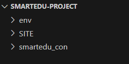

# Django Notlarım

## Django ile SmartEdu Projesi Kurulum Aşaması

1. Sanal ortam kuruyoruz(Programlar güncellendiğinde vs. eski sürümlerle devam edebilmek için)

```cmd
python -m venv env
```

2. Sanal çerçeveniyi başlatmak
```cmd
env\Scripts\activate
```
3. Django kuruyoruz
```cmd
pip install Django
```
_var olan paketleri görmek için pip freeze kullanabilriz_

4. Pip uptade uyarası gelebilir bunun için pip'i update yapcağız
```cmd
python -m pip install --upgrade pip
```

5. Django projesi oluşturuyoruz
```cmd
django-admin startproject smartedu
```
_bu komuttan sonra smartedu isimli django projesi oluşturulur içersinde smartedu dosyası ve manage.py dosyası mevcut olur.Dıştaki smartedu isimli dosyamızın ismnini karışıklık olmaması için değiştirebiliriz. smartedu-con ismini koyuyoruz_

6. Projemizin dosyasının içine giriyoruz ve Django projesini başlatıyoruz
```cmd
cd smartedu_con

python manage.py runserver
```

**Mevcut Görünüm şu şekilde olmalı;**


7. HTML-DESIGN sitesinde bir template almıştık bu dosyanın ismini SITE olarak değiştirip projemizin içerisine atıyoruz. Atacağımız yer SMARTEDU-PROJECT dosyası yanı en dış dosya.

**Mevcut Görünüm şu şekilde olmalı;**



**NOT:** Projeyi kapattıktan sonra devam etmek için geri geldiğimizde env aktif etmemiz gerekli. 

## Uygulama oluşturma aşaması

Projemizde uyulamalarımız olacak bu uygulamar aracılığıyla daha kullanışlı kolay bir proje oluşturabiliriz

1. Uygulama oluşturma;
Pages isimli bir ugulama dosyası oluşturuyoruz

```cmd
python manage.py startapp pages
```
2. Uygulamayı kaydetme;
Unutmamamız gereken önemli bir aşama uyuglamayı oluştururduktan sonra bunu ana uygulamamızın içindeki settings.py dosyasının içinde mevcut olan INSTALLED_APPS dizisinin içersine kaydetmek.
```python
INSTALLED_APPS = [
    'django.contrib.admin',
    'django.contrib.auth',
    'django.contrib.contenttypes',
    'django.contrib.sessions',
    'django.contrib.messages',
    'pages.apps.PagesConfig', # <-- Buraya kaydetttik
]
```
3. İlk Sayfası oluşturma;
Sayfa oluşturmak için bu sayfaların isteklerini ve karşılıklarını düzenleyen fonksiyonlar belirlememiz gerekli. Bu fonksiyonları views.py dosyası içersinde yazarız. Şimdi index isimli bir fonksiyon oluşturacağız
```python
from django.shortcuts import render
from django.http import HttpResponse
# Create your views here.

def index(request):
    return HttpResponse("<h1> INDEX SAYFASI</h1>")
```